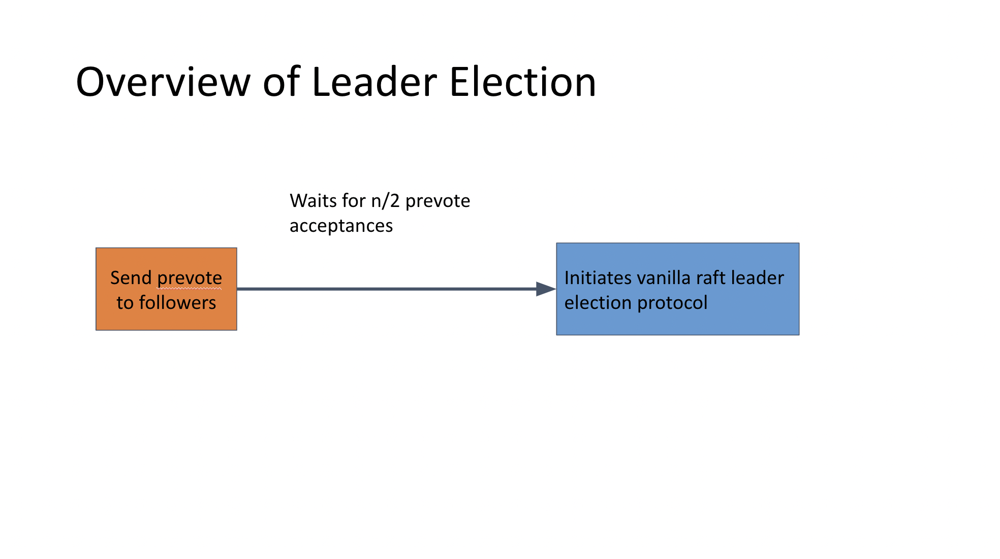
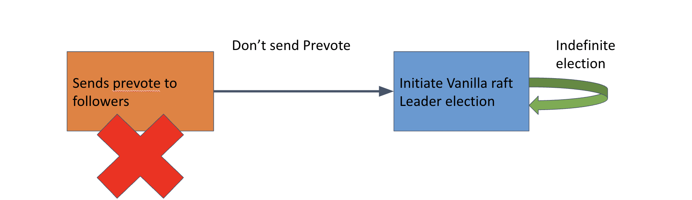

## Table of Contents
 - NuRaft Leader Election
 - Vote Monopoly (Byzantine)
### NuRaft Leader Election
The Election Protocol can be summarized as
 1. A node times out
 2. The node sends prevote request to all followers.
 3. It waits for n / 2 prevote acceptances from followers.
 4. The node initiates leader election, just like vanilla Raft.
 5. A node with majority of the votes becomes the next leader.
 6. New term commences.

 
\
### Design of Vote Monopoly
Whenever a vote monopoly node (VM), receives a message from the current leader, the following will occur:
 1. VM will directly initiate leader election.
 2. If VM obtains the most votes, it will not claim leadership
 3. The VM will initiate another leader election with a higher term.

 Since NuRaft nodes do not need to see proof of prevote acceptances, VM can lie.
 

 